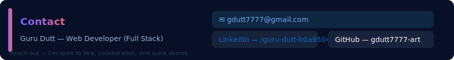

# Hii I am
#     Guru Dutt 👋

## Tagline
Warrior of Code — crafting reliable, team-driven web solutions with punctuality and purpose.

---

## About
I’m a confident, professional, team-oriented full‑stack web developer who values punctuality and clear communication. I build practical web apps that help real people and organizations.

- Title: Web Developer (Full Stack)  
- Looking for: Collaboration, freelance work, or full‑time roles — open to hire and eager to join a great team.

---

## Top Skills

  
  
  
  
  
  

- Java (OOP) — robust backend logic  
- HTML — semantic & accessible structure  
- Python — scripting & tooling  
- VS Code — efficient development flow  
- Git / GitHub — version control & reviews  
- Chrome DevTools — debugging & performance

---

## Featured Project — new.jv
An app I built for the NGO Sarathi to practice full‑stack development and deliver a lightweight, practical tool.

[View repository →](https://github.com/gdutt7777-art/new-jv)

Languages: HTML • Java

Short overview  
I built new.jv solo to combine clean HTML with simple Java logic. It helps NGO staff with basic workflows while staying accessible, fast, and easy to maintain.

Why this matters
- Real impact: a practical tool for NGO staff and volunteers  
- Focused learning: stronger HTML and Java skills through real work  
- Product-first: simple, maintainable features that solve real problems

Key features
- Semantic HTML for forms and pages  
- Java logic for interactive elements and validation  
- Mobile-first responsive design  
- Lightweight assets for low-bandwidth use  
- Simple admin-style interface for NGO users

Try it locally
1. Clone the repo:  
   git clone https://github.com/gdutt7777-art/new-jv.git

2. Open the HTML files in a browser (static) or run Java parts with your preferred Java server/tooling.

How to help
- Star the repo ⭐  
- Open issues for bugs or ideas — feedback welcome  
- Submit small PRs for polish or accessibility

---

## Conclusion
new.jv began as a personal challenge and became a practical tool for Sarathi. If you’d like a quick demo, feedback, or to collaborate — drop me a line.

---

## Contact

  
  
  

<?xml version="1.0" encoding="UTF-8"?>
<svg width="900" height="120" viewBox="0 0 900 120" xmlns="http://www.w3.org/2000/svg" role="img" aria-label="Contact card for Guru Dutt">
  <defs>
    <linearGradient id="gradA" x1="0" x2="1">
      <stop offset="0" stop-color="#7B61FF"/>
      <stop offset="1" stop-color="#FF6B6B"/>
    </linearGradient>
    <filter id="softShadow" x="-50%" y="-50%" width="200%" height="200%">
      <feDropShadow dx="0" dy="6" stdDeviation="10" flood-color="#000" flood-opacity="0.25"/>
    </filter>
  </defs>

  <!-- Card background -->
  <rect x="0" y="0" width="900" height="120" rx="12" fill="#071026"/>

  <!-- Left accent bar -->
  <rect x="16" y="16" width="8" height="88" rx="4" fill="url(#gradA)" />

  <!-- Title -->
  <g transform="translate(40,36)" filter="url(#softShadow)">
    <text x="0" y="14" font-family="Segoe UI, Roboto, Arial, sans-serif" font-size="20" font-weight="700" fill="url(#gradA)">
      Contact
    </text>
    <text x="0" y="46" font-family="Segoe UI, Roboto, Arial, sans-serif" font-size="14" fill="#9fb4d6">
      Guru Dutt — Web Developer (Full Stack)
    </text>
  </g>

  <!-- Email block -->
  <g transform="translate(420,22)">
    <rect x="0" y="0" rx="8" ry="8" width="440" height="34" fill="#0f2740" />
    <text x="14" y="22" font-family="Segoe UI, Roboto, Arial, sans-serif" font-size="14" fill="#74b0ff">
      ✉️ gdutt7777@gmail.com
    </text>
  </g>

  <!-- Links row -->
  <g transform="translate(420,62)">
    <rect x="0" y="0" rx="8" ry="8" width="210" height="34" fill="#17233a" />
    <text x="14" y="22" font-family="Segoe UI, Roboto, Arial, sans-serif" font-size="14" fill="#0A66C2">
      LinkedIn — /guru-dutt-b0a850412
    </text>

    <rect x="230" y="0" rx="8" ry="8" width="210" height="34" fill="#17233a" />
    <text x="244" y="22" font-family="Segoe UI, Roboto, Arial, sans-serif" font-size="14" fill="#ffffff">
      GitHub — gdutt7777-art
    </text>
  </g>

  <!-- subtle footer -->
  <text x="20" y="110" font-family="Segoe UI, Roboto, Arial, sans-serif" font-size="11" fill="#2a4056">
    Reach out — I’m open to hire, collaboration, and quick demos.
  </text>
</svg>
---

## What I Enjoy
- Turning designs into accessible, responsive websites  
- Writing clean, maintainable Java code  
- Rapid prototyping and iterative teamwork  
- Building tools that help organizations deliver value

---
