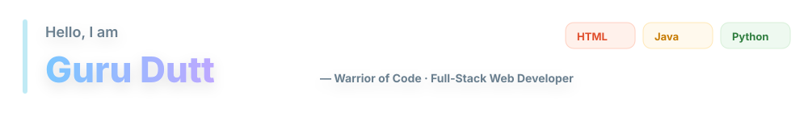
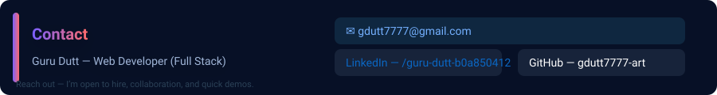

<!-- Creative intro banner -->


# Guru Dutt 👋


[](https://github.com/gdutt7777-art/new-jv)
[]()

---

## Tagline
Warrior of Code — crafting reliable, team-driven web solutions with punctuality and purpose.

---

## About
I’m a confident, professional, team-oriented full‑stack web developer who values punctuality and clear communication. I build practical web apps that help real people and organizations.

- Title: Web Developer (Full Stack)  
- Looking for: Collaboration, freelance work, or full‑time roles — open to hire and eager to join a great team.

---

## Top Skills
<p>
  
  
  
  
  
  
  
  
  
  
  
</p>

- Java (OOP) — robust backend logic  
- HTML — semantic & accessible structure  
- CSS — responsive, polished interfaces  
- Python — scripting, automation, and tooling  
- NumPy — numerical computing and data operations  
- Pandas — data wrangling and analysis  
- Matplotlib — data visualization and reporting  
- Tkinter — desktop app interfaces  
- VS Code — efficient development flow  
- Git / GitHub — version control & reviews  
- Chrome DevTools — debugging & performance

---

## Featured Project — Project STOK-MARK
**STOK-MARK – Trading Tracker** is a web-based stock-market analysis and trading simulation application designed to help users analyse historical stock data and understand trading performance.

[View repository →](https://github.com/gdutt7777-art/Project-STOK-MARK)

### Technologies
Python • Flask • Pandas • NumPy • yfinance • HTML5 • CSS3 • JavaScript • Chart.js

### Overview
The application retrieves historical market data and applies technical-analysis techniques such as Moving Average, RSI, and MACD to generate rule-based Buy, Hold, and Sell signals. It also provides an educational backtesting facility for testing a trading strategy over a selected historical period using specified initial capital.

### Key features
- Historical stock-market data retrieval using yfinance  
- Technical indicators including Moving Average, RSI, and MACD  
- Rule-based Buy, Hold, and Sell signal generation  
- Strategy backtesting over a selected historical period  
- Performance metrics including Total Return, CAGR, Maximum Drawdown, Volatility, Sharpe Ratio, Win Rate, Number of Trades, Best Trade, and Worst Trade  
- Buy-and-hold performance comparison  
- Interactive stock-price, portfolio-performance, signal, and analytics charts using Chart.js  
- Modular architecture for data retrieval, strategy analysis, signal generation, backtesting, and analytics

### Architecture flow
**User Input** → **Web Dashboard** → **Flask Backend** → **Historical Data Retrieval** → **Pandas & NumPy Processing** → **Technical Analysis** → **Signal Generation** → **Backtesting** → **Performance Analytics** → **Charts & Results**

### Project objective
STOK-MARK combines technical indicators, automated data processing, trading signals, performance analytics, and visual charts in one dashboard. It is primarily an educational and analytical tool for understanding stock-market data and evaluating trading strategies using historical data, not a source of guaranteed predictions about future market performance.

### Try it locally
1. Clone the repository:
   ```bash
   git clone https://github.com/gdutt7777-art/Project-STOK-MARK.git
   ```
2. Follow the setup instructions in the project repository to install dependencies and run the Flask application.

---

## Conclusion
Project STOK-MARK combines Python-based data analysis with an interactive Flask dashboard to make technical analysis and historical strategy backtesting easier to understand. If you’d like to explore the project or collaborate, feel free to get in touch.

---

## Contact


<p>
  <a href="mailto:gdutt7777@gmail.com"></a>
  <a href="https://www.linkedin.com/in/guru-dutt-b0a850412"></a>
  <a href="https://github.com/gdutt7777-art"></a>
</p>

---

## What I Enjoy
- Turning designs into accessible, responsive websites  
- Writing clean, maintainable Java code  
- Rapid prototyping and iterative teamwork  
- Building tools that help organizations deliver value

---

If you want, I can commit these files to your profile repo (confirm repo = gdutt7777-art/gdutt7777-art and branch), or tweak colors/fonts in the intro SVG. 
