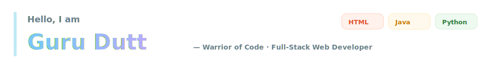
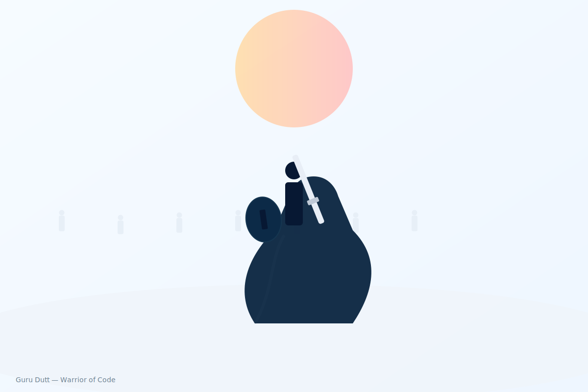

<!-- Creative intro banner -->

# Guru Dutt 👋

---

## Tagline
Warrior of Code — crafting reliable, team-driven web solutions with punctuality and purpose.

---

## About
I’m a confident, professional, team-oriented full‑stack web developer who values punctuality and clear communication. I build practical web apps that help real people and organizations.

- Title: Web Developer (Full Stack)  
- Looking for: Collaboration, freelance work, or full‑time roles — open to hire and eager to join a great team.

---

## Top Skills

  
  
  
  
  
  

- Java (OOP) — robust backend logic  
- HTML — semantic & accessible structure  
- Python — scripting & tooling  
- VS Code — efficient development flow  
- Git / GitHub — version control & reviews  
- Chrome DevTools — debugging & performance

---

## Featured Project — new.jv
An app I built for the NGO Sarathi to practice full‑stack development and deliver a lightweight, practical tool.

[View repository →](https://github.com/gdutt7777-art/new-jv)

Languages: HTML • Java

Short overview  
I built new.jv solo to combine clean HTML with simple Java logic. It helps NGO staff with basic workflows while staying accessible, fast, and easy to maintain.

Why this matters
- Real impact: a practical tool for NGO staff and volunteers  
- Focused learning: stronger HTML and Java skills through real work  
- Product-first: simple, maintainable features that solve real problems

Key features
- Semantic HTML for forms and pages  
- Java logic for interactive elements and validation  
- Mobile-first responsive design  
- Lightweight assets for low-bandwidth use  
- Simple admin-style interface for NGO users

Try it locally
1. Clone the repo:  
   git clone https://github.com/gdutt7777-art/new-jv.git

2. Open the HTML files in a browser (static) or run Java parts with your preferred Java server/tooling.

How to help
- Star the repo ⭐  
- Open issues for bugs or ideas — feedback welcome  
- Submit small PRs for polish or accessibility

---

## Conclusion
new.jv began as a personal challenge and became a practical tool for Sarathi. If you’d like a quick demo, feedback, or to collaborate — drop me a line.

---

## Contact

  
  
  

---

## What I Enjoy
- Turning designs into accessible, responsive websites  
- Writing clean, maintainable Java code  
- Rapid prototyping and iterative teamwork  
- Building tools that help organizations deliver value

---

If you want, I can commit these files to your profile repo (confirm repo = gdutt7777-art/gdutt7777-art and branch), or tweak colors/fonts in the intro SVG. 